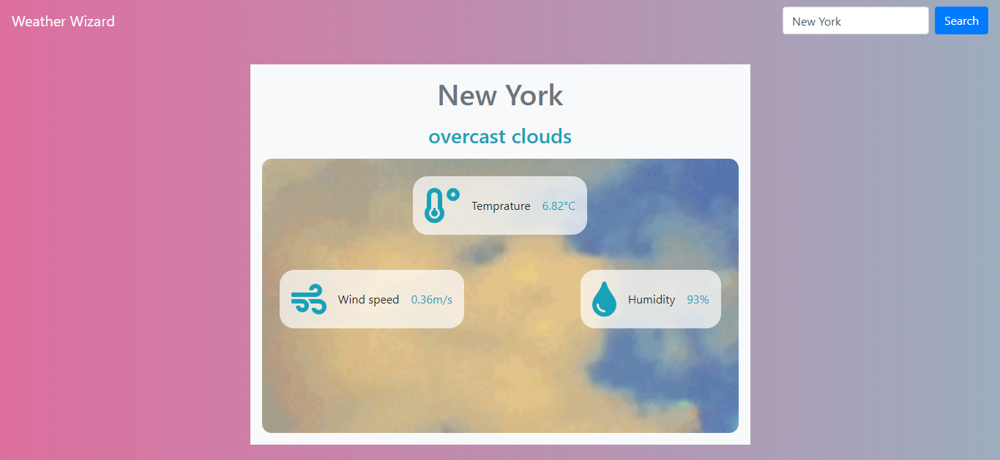

# Weather Wizard

This Web Application can get weather information anywhere in the world. It makes use of an awesome API provided by [OpenWeather](https://openweathermap.org/). All you need to do is search for the city name. Just give it a try!

## Application Screenshot

## Built With

- HTML,
- CSS,
- ES6,
- Bootsrap 4.6.0,
- Webpack 5.24.2
- VS Code
- Firefox Developer Edition

## Live Demo

[Githack](https://raw.githack.com/8Bts/Weather-App/w-app/dist/index.html)

## Getting Started

  If you want to try this application locally, follow the steps below:

  1. Clone the project using `git clone https://github.com/8Bts/Weather-App.git` command.

  2. run `npm install`.

  3. Open index.html using your browser.

## Author

👤 **Rashid Mammadli**

- Github: [8Bts](https://github.com/8Bts)
- Twitter: [@Rasheed49705929](https://twitter.com/Rasheed49705929)
- Linkedin: [Rashid Mammadli](https://www.linkedin.com/in/rashidmammadli/)
- Email: mcmizze@yahoo.com

## 🤝 Contributing

Contributions, issues and feature requests are welcome!

Feel free to check the <a href="https://github.com/8Bts/Weather-App/issues" target="_blank">issues page</a>.

## Show your support

Give a ⭐️ if you like this project!

## Acknowledgments

- [Microverse - Web Development School](https://www.microverse.org/)
- [MDN WEB DOCS](https://developer.mozilla.org/)
- [Open Weather](https://openweathermap.org/)
- [Giphy](https://developers.giphy.com/)
- <a href="https://www.w3schools.com/" target="_blank">w3schools.com</a> 
- <a href="https://www.theodinproject.com/" target="_blank">The Odin Project</a>
- <a href="https://www.stackoverflow.com/" target="_blank">Stackoverflow</a>

